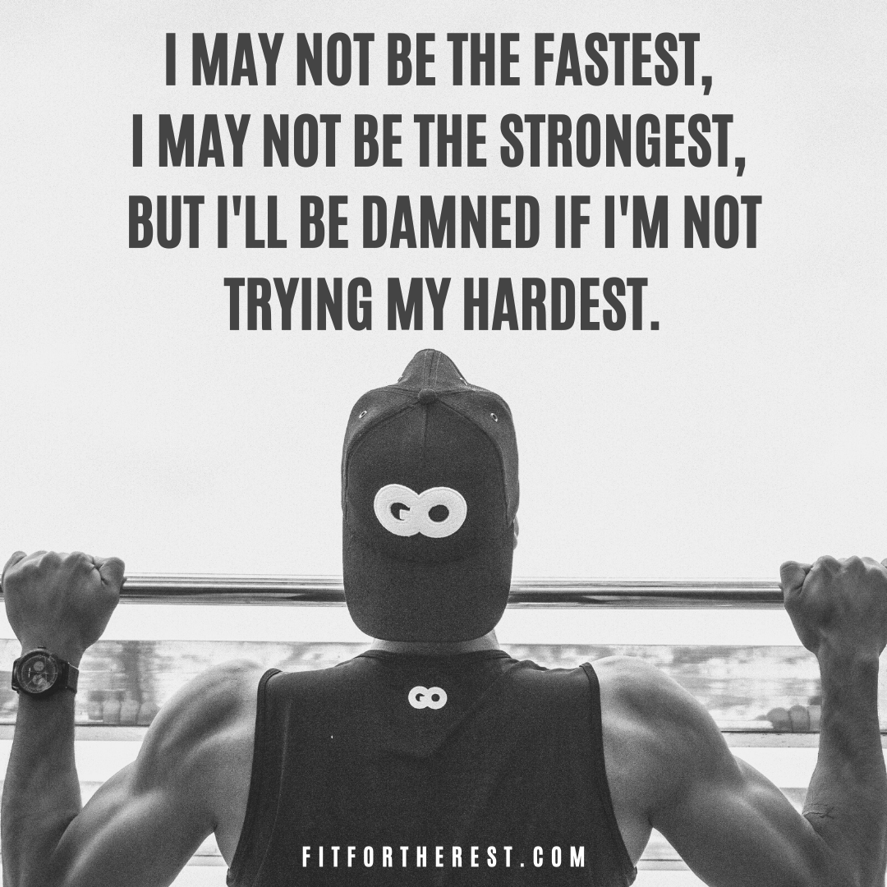
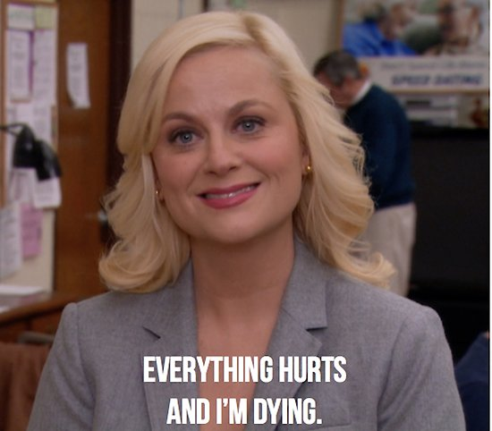
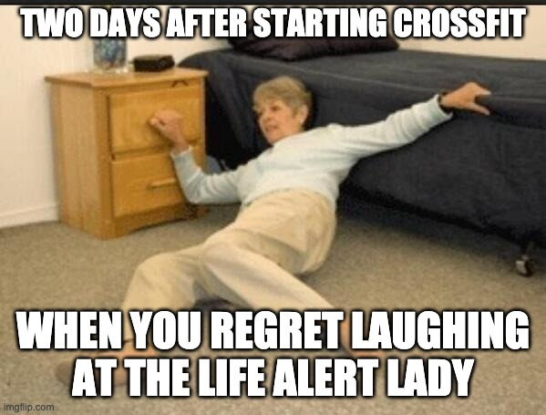
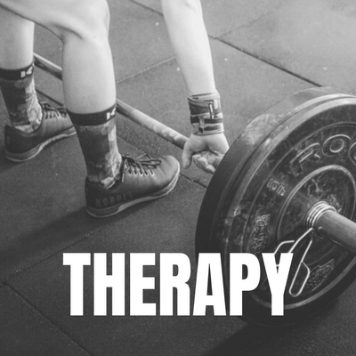
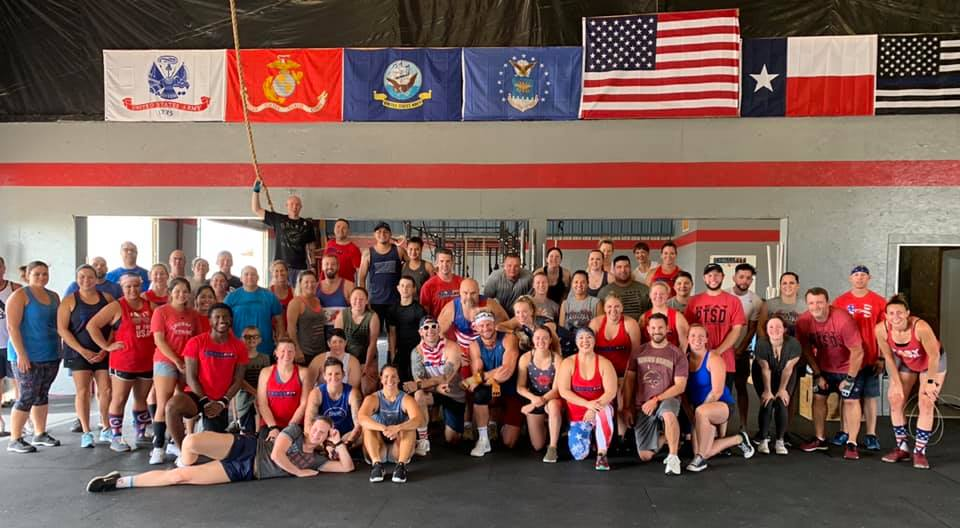
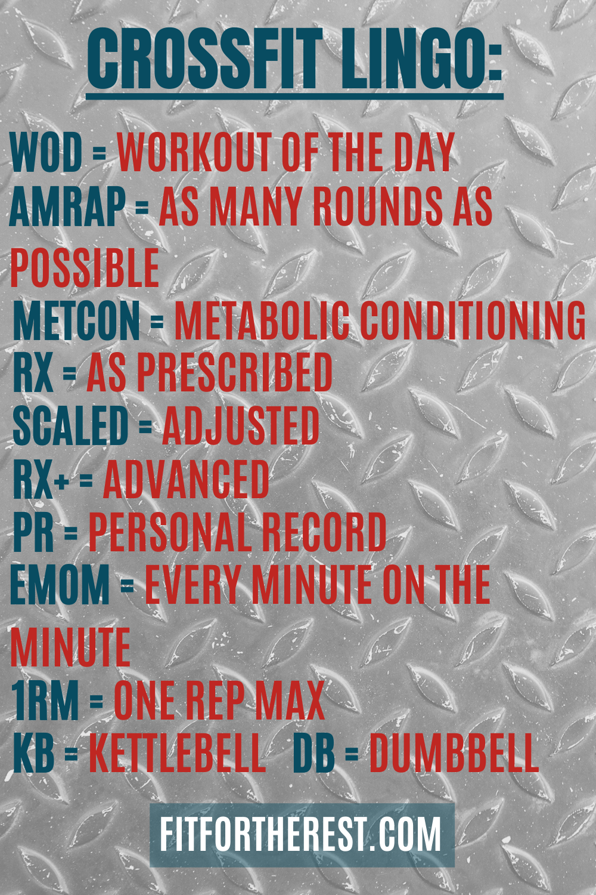
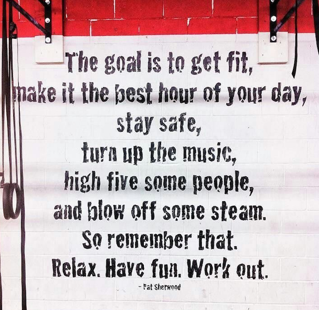
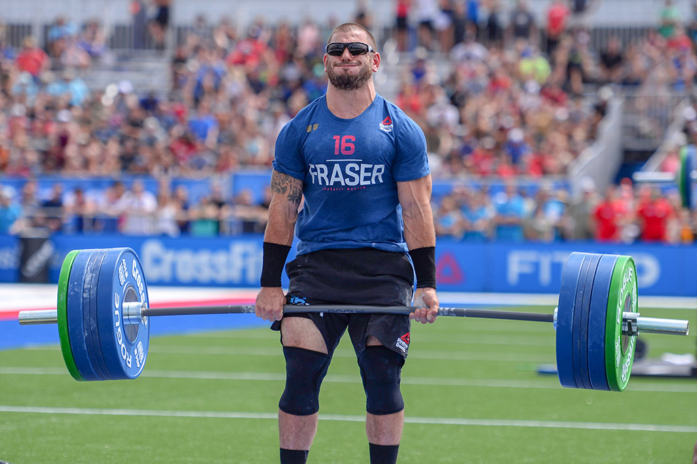

# 12 Pieces of Advice Before Your First CrossFit Class

Congratulations! You’ve found a CrossFit gym and decided to give it a try.  Not everyone is as brave as you are.  I remember going to my first class - I was so intimidated and nervous that I almost cried. After two years, I’m by no means a pro, but I’ve learned a few things. Here are 12 tips that will give you an idea of what to expect and hopefully make things a little easier for you. 

1. **You’re not going to die.** 
 
Some of you are about to take a huge leap outside of your comfort zone either physically, socially, or both.  But I promise you’ll be fine. When you look around the gym, remember that every single person you see survived _their_ first CrossFit class. And you will too.

Maybe you’re like me, and you are more afraid of potential embarrassment than anything. No one is going to laugh at you, judge you, or criticize you. In fact, you’ll probably get extra fist bumps and encouragement because everyone else remembers what it was like to be the “new kid.”

The workout is going to be _really_ hard.  But if you find the right balance between pushing yourself and choosing _appropriate difficulty_ (see tip #5), you’ll be fine.  The worst that might happen is you take a medicine ball to the face (me), box to the shin (also me), or have a resistance band snap and hit you in the face (ok, that one wasn’t me, but it was someone I know.)

2. **Just keep going.** 

Every once in awhile, I see a Metcon* and think, “There’s no way I’m going to finish this.” But most Metcons have a time-cap.  And in those cases, I tell myself, “Just keep moving for ___ minutes.” Sometimes I’m right- I don’t finish. But I worked really hard for those minutes. I’m huffing and puffing and collapsed on the floor like everybody else. Who cares if I didn’t finish? 

And then there are other times when I surprise myself and finish, right under the buzzer. Those feel really good. 

So whether it’s a seven-minute sprint or a 42-minute burner, just keep moving. Are you sweating?  Is your breathing heavy? Good. You’re doing it right. 

_*Metcon is short for Metabolic Conditioning. Most CrossFit workouts consist of a weightlift portion, followed by a Metcon.  Metcons usually involve a repeated series of high-intensity movements (but remember, everything is scalable) for an extended period of time. A Metcon might be referred to as an AMRAP (as many rounds/reps as possible). Or, you try to complete a certain number of rounds within a given time cap.   Read more about Metcons [here](https://www.si.com/edge/2016/12/12/met-con-workouts-metabolic-conditioning-training-guide)._ 

3. **You are going to be sore tomorrow.  And even _more_ sore the day after.** 

Your legs will feel like cement.  Sitting down on the toilet will hurt.  Laughing will hurt. Lifting your arms will hurt. You will discover muscles you didn’t realize you had because you’ve never really worked them before. Delayed Onset Muscle Soreness, or DOMS, is extremely common with people who are starting an intense exercise regimen. 

When you begin or dramatically increase weight training, you create microscopic tears in your muscle fibers. This damage leads to inflammation as your body tries to repair those tears and rebuild the muscle. Soreness is most intense 24 to 72 hours after a challenging workout.  You can read more about DOMS in this [helpful article](https://www.healthline.com/health/doms#should-you-rest). 

Resist the urge to sit on the couch for a few days, thinking you are “too sore to workout.” In fact, movement (along with drinking plenty of water) is one of the best ways to ease the pain of DOMS. 

DOMS doesn’t last forever, I promise. If you stick with CrossFit, your body will get stronger and your muscles more accustomed to the movements and intensity.  Now I’m not saying that you will never be sore again. Certain workouts might burn longer and stronger than others, but you do not need to feel DOMS every single time to know that you’re getting a good workout. 

4. **DO NOT compare yourself to the person next to you.**

This is such an important piece of advice for anyone doing CrossFit. Even after over two years, this is probably my biggest daily struggle.

Especially as a beginner, don’t think that you should be lifting the same weight as everyone else.  Do not be discouraged if you end up at the bottom of the leaderboard.  People have different strengths and different bodies.  The only person you should be competing with is yourself. 

One cool thing about CrossFit is that you are able to track your performance (your gym may have a preferred app) in weightlifting and metcons.  Over time, you have solid data to show how much progress you’re making.  And when you hit a personal record (PR), wow! That’s awesome! Congratulate yourself and resist the urge to think, “Well, that’s nothing compared to ____.” (I’m definitely guilty of that one.)

5. **Scale.**

What does it mean to scale a workout? [This expert](https://www.boxrox.com/what-is-scaling-in-crossfit/) says it best when he writes, **_“Scaling allows any athletes to complete the same workout, regardless of ability, simply by altering the weights and movements in order to produce the same level of intensity.”_**

Most Metcon workouts will have a prescribed version, known as “RX.” It’s a suggestion meant to challenge the experienced athletes. But every movement can be scaled.  

For example, ten snatches at 115/85 lbs (men/women) can be scaled down to 55 lbs or done with an empty barbell. 12 toes-to-bar can be scaled to hanging knee raises. Or maybe you only do 6 toes-to-bar.  There are always options.  The goal is to find something that is challenging yet doable. 

**_Scaling a workout is not a sign of weakness._** 

Unsure of how to best scale a workout? Ask your coach and they would be more than happy to give you some recommendations.

6. **Just keep going.**

Show up for class.  It’s a lot easier to stay at home on the couch than it is to get in the car and drive to the gym. But remember why you decided to start CrossFit in the first place.  Nothing worth having ever comes easy. 

I have never once finished a class and said to myself, “You know what? I wish I hadn’t gone to CrossFit today.” But too many times I’ve talked myself out of going to class because “I’m tired,” or “I’m sore,” or “I have a headache.” And then later, I feel just as crappy as I did before and end up wishing I had gone to class! 
Yes, rest days are important (see #9). And if you are injured, definitely take it easy. But before you decide to skip a class, ask yourself if it is intentional rest or if you are avoiding something. 
If it’s the latter, stop making excuses.Just shut up and go to CrossFit! 

7. **Get to know the other members.**

You are more likely to stick with a goal if you feel invested.  And a key way to boost our investment in anything is to build relationships and surround ourselves with people who support or are a part of our goal. 

Think of it as positive peer pressure.

Your gym peers will not only encourage you to push through a tough workout, they’ll motivate you to keep showing up for class. 

And working out alongside a friend makes it suck a little less.

Here are the amazing members of my box- [CrossFit Strive Bastrop](https://www.crossfitstrivebastrop.com). Hopefully, you find your own Fit Family.  

8. **Don't be afraid to ask questions.**

One time at the beginning of a class, the coach finished explaining a workout and ended with “Any questions?” A new person responded with, “Ummm...what the hell are double-unders?” 

There is a lot of CrossFit jargon and abbreviations, and sometimes we forget that newbies might not be familiar with everything.  Just ask. No one is going to laugh at you for not knowing what an EMOM is, or if you don’t know the difference between a jerk and a snatch (it took me a while to remember which was which).

If the WOD says to back squat 80% of your 1-Rep Max and you’ve never even done a back squat before, ask the coach. They can help you choose the right weight.

Coaches like being asked questions because it makes them feel more engaged in what they’re doing.  And it allows them to show off their expertise. 

Don’t know how to best scale a WOD? Ask. 
Something in your lift doesn’t feel right? Ask. 
Don’t know where the restroom is? Please ask. 

9. **Rest**

_You won’t make gains unless you rest._ 

Remember when I talked about DOMS in #3? Intense strength training breaks down muscle and your body needs to rebuild that muscle in order to get stronger. Give it the time to rebuild.

And if you’re injured, PLEASE, for the love of Wod, take a few days off. 

Finding a balance of work to rest days can be tricky. Here are two helpful rules-of-thumb:

* 3-to-1:  Work out for three days, take one day off.  Repeat.
* 4/2 max: Don’t work out more than four days in a row.  Don’t take more than two days off in a row. 

But ultimately, the right rule is the one that works best for you.

10. **Try to have fun.**

If CrossFit was _all_ hard work and _no_ fun, it wouldn’t be as popular as it is. 

At my box, there is a healthy amount of friendly teasing and shit-talking. All in good fun. The coaches sometimes incorporate games into the warm-up. Some people sing along with the music. 

Laugh at yourself.  Laugh with others.  Don’t take it too seriously. 

11. **Just keep going.**

Seriously.  Show up. Do the work. It’s as simple as that.  As with most things in life, **_you get out what you put in_**. 

12. **It never gets easier.**

I hate to break it to you, but CrossFit will always be hard. 

There’s a reason that CrossFit champions, the fittest people on earth, still look like this when they compete. Because they are still working really hard. 

Yes, you will get more familiar with the movements and more comfortable with the barbell.  But as you get stronger, and I promise that you will, you will start to push yourself more.  The weights will get heavier.  The movements faster and more difficult.  You’ll always be raising the bar (no pun intended) for yourself. 

But that’s what I love about CrossFit.  It’s hard for **everyone**.  And if it’s not hard, then you’re not doing it right. 

No matter how big you are, how skilled you are, or how strong you are, you have something in common with every single person in the gym- you are all working your asses off. 

Ready or not, it’s time to hit the gym! I hope these tips are helpful and you’ll keep them in mind as you start making CrossFit part of your life. Some day, you will be the one giving other newbies advice! 

Good luck! Let me know how it goes!

